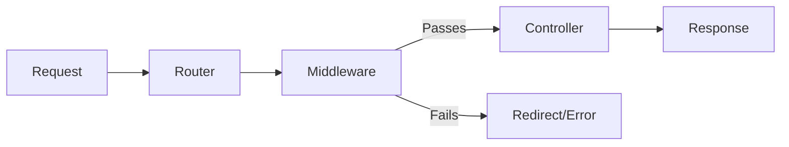

## Overview

Middleware provides a convenient mechanism to inspect and filter HTTP requests before they reach your controllers. Common use cases include authentication, authorization, logging, and request validation.

## How Middleware Works

Middleware acts as a barrier between the router and your controller. When a route has middleware attached, the middleware's `handle()` method is executed first:



## Creating Middleware

### Base Middleware Structure

All middleware classes should implement a `handle()` method:

```php app/Middleware/Middleware.php
namespace App\Middleware;

use Sphp\Core\Response; 
use Sphp\Services\Auth;

class Middleware
{
    public function handle()
    {
        return Auth::check();
    }
}
```

### Custom Middleware Example

Create your own middleware by implementing the `handle()` method:

<CodeGroup>

```php Authentication Middleware
namespace App\Middleware;

class AuthMiddleware
{
    public function handle()
    {
        // Check if user is logged in
        if (!isset($_SESSION['user_id'])) {
            return false; // User not authenticated
        }
        
        return true; // User is authenticated
    }
}
```

```php Admin Middleware
namespace App\Middleware;

class AdminMiddleware
{
    public function handle()
    {
        // Check if user is admin
        if (!isset($_SESSION['user_role']) || $_SESSION['user_role'] !== 'admin') {
            return false; // Not an admin
        }
        
        return true; // User is admin
    }
}
```

```php Rate Limit Middleware
namespace App\Middleware;

class RateLimitMiddleware
{
    public function handle()
    {
        $ip = $_SERVER['REMOTE_ADDR'];
        $limit = 100; // requests per hour
        
        // Check rate limit (implementation depends on your caching solution)
        $requests = $this->getRequestCount($ip);
        
        if ($requests >= $limit) {
            return false; // Rate limit exceeded
        }
        
        $this->incrementRequestCount($ip);
        return true;
    }
    
    private function getRequestCount($ip)
    {
        // Implementation
    }
    
    private function incrementRequestCount($ip)
    {
        // Implementation
    }
}
```

</CodeGroup>

## Attaching Middleware to Routes

Attach middleware as the fourth parameter when defining routes:

```php app/router/web.php
use App\Controllers\HomeController;
use App\Controllers\DashboardController;
use App\Middleware\AuthMiddleware;
use App\Middleware\AdminMiddleware;
use Sphp\Core\Router;

$router = new Router();

// Public routes (no middleware)
$router->get('/', HomeController::class, 'index');
$router->post('/login', HomeController::class, 'login');

// Protected routes (with authentication middleware)
$router->get(
    '/dashboard', 
    DashboardController::class, 
    'index',
    AuthMiddleware::class  // Fourth parameter is middleware
);

// Admin-only routes
$router->get(
    '/admin/users', 
    AdminController::class, 
    'users',
    AdminMiddleware::class
);

$router->dispatch();
```

## Middleware Execution Flow

Here's how the router handles middleware:

```php Sphp/Core/Router.php
private function handle_request($route, $params = [], $previous_url = '/')
{
    // Middleware handling
    $middleware = $route['middelware'];
    if ($middleware) {
        $response_from_middleware = $this->handleMiddleware($middleware);
        
        if (is_bool($response_from_middleware)) {
            if (!$response_from_middleware) {
                // Middleware returned false - show 403 Forbidden
                View::render('403.html');
                exit;
            }
        } else {
            // Middleware returned non-boolean - redirect to previous page
            redirect($previous_url);
        }
    }

    // Middleware passed - call the controller
    $this->callController($route, $params);
}
```

### Middleware Handler

The router invokes middleware through the `handleMiddleware()` method:

```php Sphp/Core/Router.php
private function handleMiddleware($middleware)
{
    if (class_exists($middleware)) {
        $middleware_object = new $middleware();
        
        if (method_exists($middleware_object, 'handle')) {
            return $middleware_object->handle();
        } else {
            return Response::response('500', 'Internal server Error, No Middleware Method exist');
        }
    } else {
        return Response::response('500', 'Internal server Error, No Middleware Class exist');
    }
}
```

## Middleware Return Values

Middleware can return different values to control the request flow:

<ResponseField name="true" type="boolean">
Allow the request to proceed to the controller.
</ResponseField>

<ResponseField name="false" type="boolean">
Reject the request and show a 403 Forbidden page.
</ResponseField>

<ResponseField name="Response object" type="object">
Redirect the user to the previous URL (stored in session).
</ResponseField>

### Example Return Types

```php
namespace App\Middleware;

class ExampleMiddleware
{
    public function handle()
    {
        // Option 1: Allow access
        if ($this->userIsAuthenticated()) {
            return true;
        }
        
        // Option 2: Deny access (shows 403.html)
        if ($this->userIsBanned()) {
            return false;
        }
        
        // Option 3: Redirect to previous page
        return Response::redirect('/login');
    }
}
```

## Common Middleware Patterns

### Authentication Check

```php
namespace App\Middleware;

use Sphp\Services\Auth;

class AuthMiddleware
{
    public function handle()
    {
        // Check if user is authenticated
        if (!Auth::check()) {
            // Redirect to login page
            header('Location: /login');
            exit;
        }
        
        return true;
    }
}
```

### Role-Based Access Control

```php
namespace App\Middleware;

class RoleMiddleware
{
    private $requiredRole;
    
    public function __construct($role = 'user')
    {
        $this->requiredRole = $role;
    }
    
    public function handle()
    {
        if (!isset($_SESSION['user_role'])) {
            return false;
        }
        
        $userRole = $_SESSION['user_role'];
        $roleHierarchy = ['user' => 1, 'moderator' => 2, 'admin' => 3];
        
        if ($roleHierarchy[$userRole] >= $roleHierarchy[$this->requiredRole]) {
            return true;
        }
        
        return false;
    }
}
```

### CSRF Protection

```php
namespace App\Middleware;

class CsrfMiddleware
{
    public function handle()
    {
        if ($_SERVER['REQUEST_METHOD'] === 'POST') {
            $token = $_POST['csrf_token'] ?? '';
            
            if (!$this->validateCsrfToken($token)) {
                return false; // Invalid CSRF token
            }
        }
        
        return true;
    }
    
    private function validateCsrfToken($token)
    {
        return isset($_SESSION['csrf_token']) && 
               hash_equals($_SESSION['csrf_token'], $token);
    }
}
```

### Request Logging

```php
namespace App\Middleware;

class LoggingMiddleware
{
    public function handle()
    {
        $logEntry = sprintf(
            "[%s] %s %s - User: %s\n",
            date('Y-m-d H:i:s'),
            $_SERVER['REQUEST_METHOD'],
            $_SERVER['REQUEST_URI'],
            $_SESSION['user_id'] ?? 'guest'
        );
        
        file_put_contents(
            '../storage/logs/requests.log', 
            $logEntry, 
            FILE_APPEND
        );
        
        return true; // Always allow request to continue
    }
}
```

## Error Pages

When middleware denies access, S-PHP renders error pages:

### 403 Forbidden

Create `app/views/403.html` for unauthorized access:

```html
<!DOCTYPE html>
<html>
<head>
    <title>403 Forbidden</title>
</head>
<body>
    <h1>Access Denied</h1>
    <p>You do not have permission to access this resource.</p>
</body>
</html>
```

### Custom Error Handling

You can customize error responses in your middleware:

```php
namespace App\Middleware;

use Sphp\Core\View;

class CustomAuthMiddleware
{
    public function handle()
    {
        if (!isset($_SESSION['user_id'])) {
            // Custom error page or redirect
            View::render('errors/login-required.php', [
                'redirect_to' => $_SERVER['REQUEST_URI']
            ]);
            exit;
        }
        
        return true;
    }
}
```

## Best Practices

<AccordionGroup>

<Accordion title="Single Responsibility">
Each middleware should have one clear purpose:

```php
// Good: Separate middleware for different concerns
class AuthMiddleware { } // Handles authentication
class AdminMiddleware { } // Handles admin authorization
class CsrfMiddleware { }  // Handles CSRF protection

// Avoid: One middleware doing everything
class SecurityMiddleware { } // Too broad
```
</Accordion>

<Accordion title="Early Returns">
Return as early as possible to improve performance:

```php
public function handle()
{
    // Check the quickest conditions first
    if (!isset($_SESSION['user_id'])) {
        return false;
    }
    
    if (!$this->hasPermission()) {
        return false;
    }
    
    return true;
}
```
</Accordion>

<Accordion title="Meaningful Error Messages">
Provide helpful feedback when middleware fails:

```php
public function handle()
{
    if (!isset($_SESSION['user_id'])) {
        $_SESSION['error'] = 'Please log in to access this page';
        header('Location: /login');
        exit;
    }
    
    return true;
}
```
</Accordion>

<Accordion title="Session Management">
Ensure session is started before using middleware:

```php public/index.php
session_start();

// Then load routes with middleware
require_once __DIR__ . '/../app/router/web.php';
```
</Accordion>

</AccordionGroup>

<Warning>
Always ensure your middleware's `handle()` method returns a boolean value or properly handles redirects. Returning `null` or forgetting a return statement can lead to unexpected behavior.
</Warning>

## Middleware Limitations

Currently, S-PHP supports:
- One middleware per route
- Synchronous middleware execution
- Boolean or redirect responses

For multiple middleware on one route, create a composite middleware:

```php
namespace App\Middleware;

class CompositeMiddleware
{
    public function handle()
    {
        $authMiddleware = new AuthMiddleware();
        if (!$authMiddleware->handle()) {
            return false;
        }
        
        $roleMiddleware = new AdminMiddleware();
        if (!$roleMiddleware->handle()) {
            return false;
        }
        
        return true;
    }
}
```

## Next Steps

<CardGroup cols={2}>

<Card title="Routing" icon="route" href="/architecture/routing">
Learn how to attach middleware to routes
</Card>

<Card title="Request Lifecycle" icon="rotate" href="/architecture/request-lifecycle">
See where middleware fits in the request flow
</Card>

</CardGroup>