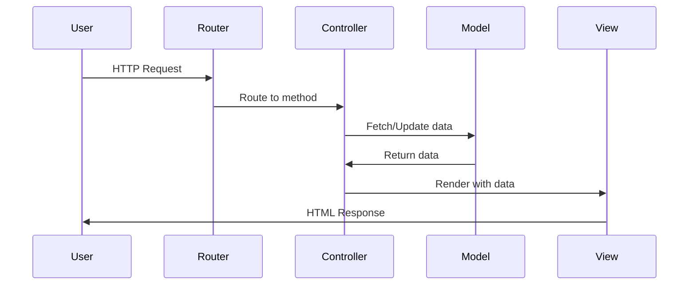

## Overview

S-PHP implements the Model-View-Controller (MVC) architectural pattern to separate concerns and organize your application code. This pattern divides your application into three interconnected components:

- **Models**: Handle data and business logic
- **Views**: Manage the presentation layer
- **Controllers**: Process requests and coordinate between Models and Views

## Framework Structure

The S-PHP framework follows this directory structure:

```
├── Sphp/Core/              # Core framework classes
│   ├── Router.php          # Routing system
│   ├── Controller.php      # Base controller
│   ├── Models.php          # Base model class
│   └── View.php            # View rendering engine
├── app/
│   ├── Controllers/        # Your application controllers
│   ├── Models/             # Your application models
│   ├── views/              # Your view templates
│   ├── Middleware/         # Middleware classes
│   ├── router/             # Route definitions
│   └── config/             # Configuration files
└── public/
    └── index.php           # Application entry point
```

## Controllers

Controllers handle incoming requests and return responses. All controllers extend the base `Controller` class which provides database access and configuration.

### Base Controller

The base controller automatically initializes database connections:

```php Sphp/Core/Controller.php
namespace Sphp\Core;

use Sphp\Core\Database;

class Controller
{
    public $env;
    public $db;

    public function __construct()
    {
        $this->env = require('../app/config/config.php');
        $this->db = new Database($this->env);
    }
}
```

### Creating a Controller

Your controllers should extend the base `Controller` class:

```php app/Controllers/HomeController.php
namespace App\Controllers;

use Sphp\Core\Controller;
use Sphp\Core\View;

class HomeController extends Controller
{
    public function index()
    {
        // Access database via $this->db
        // Access config via $this->env
        
        View::render('home.php', [
            'title' => 'Welcome'
        ]);
    }
}
```

<Note>
Controllers automatically have access to `$this->db` for database operations and `$this->env` for configuration values.
</Note>

## Models

Models represent your data layer and interact with the database. The base `Models` class provides CRUD operations.

### Base Model Features

```php Sphp/Core/Models.php
namespace Sphp\Core;

class Models
{
    protected $table;           // Database table name
    protected $fillables = [];  // Allowed fields for mass assignment
    protected $hidden_fields;   // Fields to hide in responses
    protected $db;              // Database connection
}
```

### Creating a Model

Define your model by extending the base `Models` class:

```php app/Models/User.php
namespace App\Models;

use Sphp\Core\Models;

class User extends Models
{
    protected $table = 'users';
    
    protected $fillables = [
        'name',
        'email',
        'password'
    ];
}
```

### CRUD Operations

The base model provides these methods:

<CodeGroup>

```php Create
$user = new User();
$user->create([
    'name' => 'John Doe',
    'email' => 'john@example.com',
    'password' => password_hash('secret', PASSWORD_DEFAULT)
]);
```

```php Read
// Find by ID
$user = $userModel->findByID(1);

// Select with conditions
$users = $userModel->select(
    columns: ['id', 'name', 'email'],
    where: ['status' => 'active'],
    orderBy: 'created_at DESC',
    limit: 10
);
```

```php Update
$user = new User();
$user->update([
    'name' => 'Jane Doe',
    'email' => 'jane@example.com'
], $id);
```

```php Delete
$user = new User();
$user->delete($id);
```

</CodeGroup>

<Warning>
Only fields listed in the `$fillables` array can be mass-assigned. This protects against mass assignment vulnerabilities.
</Warning>

## Views

Views handle the presentation layer. The `View` class renders templates and supports layouts and components.

### Rendering Views

```php
use Sphp\Core\View;

// Simple view
View::render('home.php');

// View with data
View::render('profile.php', [
    'user' => $user,
    'posts' => $posts
]);
```

### View Engine Features

The View class supports:

1. **Layouts**: Reusable page structures
   ```php
   @layout('main', ['title' => 'Home Page'])
   ```

2. **Components**: Reusable UI elements
   ```php
   @component('navbar', $navData)
   ```

3. **Data Extraction**: Variables are automatically extracted
   ```php
   View::render('page.php', ['name' => 'John']);
   // In view: <?php echo $name; ?>
   ```

### View Directory Structure

```
app/views/
├── layout/          # Reusable layouts
├── components/      # Reusable components
├── home.php         # Individual views
├── profile.php
└── 404.html         # Error pages
```

## MVC Flow

Here's how a typical request flows through the MVC pattern:



<Steps>

<Step title="Request arrives">
The router receives the HTTP request and matches it to a route definition.
</Step>

<Step title="Controller processes">
The router instantiates the controller and calls the specified method.
</Step>

<Step title="Model interaction">
The controller uses models to fetch or manipulate data from the database.
</Step>

<Step title="View rendering">
The controller passes data to a view for rendering the response.
</Step>

<Step title="Response sent">
The view generates HTML which is sent back to the user.
</Step>

</Steps>

## Best Practices

<AccordionGroup>

<Accordion title="Keep Controllers Thin">
Controllers should only handle request/response logic. Move business logic to models or service classes.

```php
// Good
public function store()
{
    $user = new User();
    $user->create($_POST);
    redirect('/users');
}

// Avoid heavy logic in controllers
```
</Accordion>

<Accordion title="Use Fillable Fields">
Always define `$fillables` in your models to prevent mass assignment vulnerabilities.

```php
protected $fillables = ['name', 'email'];
```
</Accordion>

<Accordion title="Separate View Logic">
Keep PHP logic minimal in views. Prepare all data in the controller.

```php
// In controller
View::render('users.php', [
    'users' => $userModel->select(['*']),
    'count' => count($users)
]);
```
</Accordion>

</AccordionGroup>

## Next Steps

<CardGroup cols={2}>

<Card title="Routing" icon="route" href="/architecture/routing">
Learn how to define routes and handle requests
</Card>

<Card title="Request Lifecycle" icon="rotate" href="/architecture/request-lifecycle">
Understand the complete request flow
</Card>

</CardGroup>