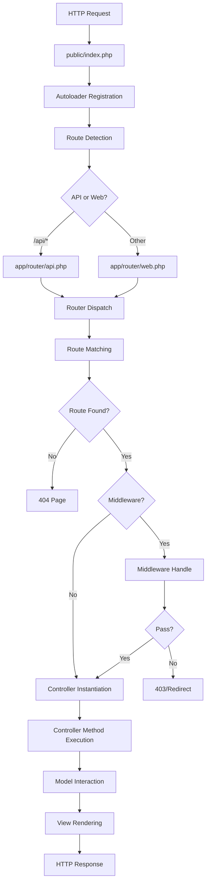

## Overview

Understanding the request lifecycle is crucial for building applications with S-PHP. This guide walks you through every stage of an HTTP request, from the moment it enters your application until a response is sent back to the user.

## Lifecycle Diagram



## Stage 1: Entry Point

Every request enters through `public/index.php`, which serves as the single entry point for your application.

```php public/index.php
require_once '../Sphp/function.php';
require_once '../vendor/autoload.php';

spl_autoload_register(function ($class) {
    $class = ltrim($class, '\\');
    $base_dir = __DIR__ . '/../';
    $class_path = str_replace('\\', '/', $class) . '.php';
    $file = $base_dir . $class_path;

    if (file_exists($file)) {
        require_once $file;
    } else {
        exit("Autoloader Error: Unable to load class '$class'. Expected file at $file not found.");
    }
});
```

<Info>
The autoloader converts namespaces to file paths. For example, `App\Controllers\HomeController` maps to `app/Controllers/HomeController.php`.
</Info>

## Stage 2: Route Detection

S-PHP determines whether the request is for the API or web routes:

```php public/index.php
$requestUri = parse_url($_SERVER['REQUEST_URI'], PHP_URL_PATH);

if (strpos($requestUri, '/api') === 0) {
    require_once __DIR__ . '/../app/router/api.php';
} else {
    require_once __DIR__ . '/../app/router/web.php';
}
```

<Tabs>
  <Tab title="Web Routes">
    Routes without the `/api` prefix load `app/router/web.php`:
    
    ```php
    // Handles: /, /dashboard, /users/123, etc.
    $router->get('/', HomeController::class, 'index');
    $router->get('/users/{id}', UserController::class, 'show');
    ```
  </Tab>
  
  <Tab title="API Routes">
    Routes starting with `/api` load `app/router/api.php`:
    
    ```php
    // Handles: /api/users, /api/users/123, etc.
    $router->get('/api/users', ApiController::class, 'index');
    $router->post('/api/users', ApiController::class, 'store');
    ```
  </Tab>
</Tabs>

## Stage 3: Router Initialization

The router file creates a `Router` instance and defines all routes:

```php app/router/web.php
use App\Controllers\HomeController;
use App\Middleware\AuthMiddleware;
use Sphp\Core\Router;

$router = new Router();

// Public routes
$router->get('/', HomeController::class, 'index');
$router->post('/login', HomeController::class, 'login');

// Protected routes
$router->get('/dashboard', HomeController::class, 'dashboard', AuthMiddleware::class);

// Dispatch the router
$router->dispatch();
```

## Stage 4: Route Matching

The `dispatch()` method matches the incoming request to a defined route:

```php Sphp/Core/Router.php
public function dispatch()
{
    // Get request details
    $method = $_SERVER['REQUEST_METHOD'];  // GET, POST, etc.
    $route = $_SERVER['REQUEST_URI'];     // /users/123

    // Remove query strings
    $route = strtok($route, '?');

    $matchedRoute = null;
    $params = [];

    // Match dynamic routes
    if ($method == 'GET') {
        foreach ($this->getRoutes as $definedRoute => $config) {
            $matchedRoute = $this->matchDynamicRoute($definedRoute, $route, $params);
            if ($matchedRoute) {
                // Track URLs for redirects
                $currentUrl = (isset($_SERVER['HTTPS']) && $_SERVER['HTTPS'] === 'on' ? "https" : "http");
                $currentUrl .= "://{$_SERVER['HTTP_HOST']}{$_SERVER['REQUEST_URI']}";

                $_SESSION['previous_url'] = $_SESSION['current_url'] ?? '/'; 
                $_SESSION['current_url'] = $currentUrl;
                $prev_url = $_SESSION['previous_url'] == $_SESSION['current_url'] ? "/" : $_SESSION['previous_url'];
                
                $this->handle_request($config, $params, $prev_url);
                return;
            }
        }
    }
    
    // No route found
    View::render('404.html');
}
```

### Dynamic Route Matching

The router converts route patterns to regex for matching:

```php
// Route pattern: /users/{id}
// Regex pattern: /users/([^/]+)
// Matches: /users/123, /users/abc, etc.

private function matchDynamicRoute($definedRoute, $currentRoute, &$params)
{
    // Convert {id} placeholders to regex
    $definedRoutePattern = preg_replace('/\{[a-zA-Z0-9_]+\}/', '([^/]+)', $definedRoute);
    $definedRoutePattern = str_replace('/', '\\/', $definedRoutePattern);

    if (preg_match('/^' . $definedRoutePattern . '$/', $currentRoute, $matches)) {
        array_shift($matches); // Remove full match
        $params = $matches;    // Extract parameters
        return true;
    }

    return false;
}
```

<Steps>

<Step title="Pattern Conversion">
The route pattern `/users/{id}` is converted to the regex `/users/([^/]+)`.
</Step>

<Step title="Regex Matching">
The regex is tested against the current URL path.
</Step>

<Step title="Parameter Extraction">
If matched, captured groups become the `$params` array.
</Step>

</Steps>

## Stage 5: Session Tracking

For GET requests, S-PHP tracks the current and previous URLs:

```php
$_SESSION['previous_url'] = $_SESSION['current_url'] ?? '/'; 
$_SESSION['current_url'] = $currentUrl;
```

This is useful for:
- Redirecting users back after login
- "Return to previous page" functionality
- Breadcrumb navigation

## Stage 6: Middleware Execution

If the route has middleware, it's executed before the controller:

```php Sphp/Core/Router.php
private function handle_request($route, $params = [], $previous_url = '/')
{
    // Middleware handling
    $middleware = $route['middelware'];
    if ($middleware) {
        $response_from_middleware = $this->handleMiddleware($middleware);
        
        if (is_bool($response_from_middleware)) {
            if (!$response_from_middleware) {
                View::render('403.html');
                exit;
            }
        } else {
            redirect($previous_url);
        }
    }

    $this->callController($route, $params);
}
```

### Middleware Flow

<CodeGroup>

```php Middleware Pass
// Middleware returns true
public function handle()
{
    if (Auth::check()) {
        return true; // Continue to controller
    }
}
```

```php Middleware Fail
// Middleware returns false
public function handle()
{
    if (!Auth::check()) {
        return false; // Show 403.html
    }
}
```

```php Middleware Redirect
// Middleware returns non-boolean
public function handle()
{
    if (!Auth::check()) {
        header('Location: /login');
        exit; // Redirect to login
    }
}
```

</CodeGroup>

## Stage 7: POST Data Sanitization

For POST requests, S-PHP automatically sanitizes input:

```php Sphp/Core/Router.php
elseif ($method == 'POST') {
    foreach ($this->postRoutes as $definedRoute => $config) {
        $matchedRoute = $this->matchDynamicRoute($definedRoute, $route, $params);
        if ($matchedRoute) {
            // Sanitize HTML (except 'content' field)
            if(!$_POST['content']) {
                $_POST = sanitizeHtml($_POST);
            }
            $this->handle_request($config, $params);
            return;
        }
    }
}
```

<Warning>
The `content` field is excluded from sanitization to allow rich text editors. Always sanitize this field manually if needed.
</Warning>

## Stage 8: Controller Instantiation

The router instantiates the controller and calls the method:

```php Sphp/Core/Router.php
private function callController($route, $params = [])
{
    $controllerName = $route['controller'];
    $methodName = $route['method'];

    if (class_exists($controllerName)) {
        $controller = new $controllerName();
        if (method_exists($controller, $methodName)) {
            // Pass parameters to the controller method
            call_user_func_array([$controller, $methodName], $params);
        } else {
            echo "Method $methodName not found in $controllerName.";
        }
    } else {
        echo "Controller $controllerName not found.";
    }
}
```

### Controller Initialization

When instantiated, controllers automatically set up database and config:

```php Sphp/Core/Controller.php
class Controller
{
    public $env;
    public $db;

    public function __construct()
    {
        $this->env = require('../app/config/config.php');
        $this->db = new Database($this->env);
    }
}
```

## Stage 9: Controller Method Execution

The controller method processes the request:

```php
namespace App\Controllers;

use Sphp\Core\Controller;
use Sphp\Core\View;
use App\Models\User;

class UserController extends Controller
{
    public function show($id)
    {
        // Access database via inherited $this->db
        $user = $this->db->query(
            "SELECT * FROM users WHERE id = ?", 
            [$id]
        );
        
        // Or use a model
        $userModel = new User();
        $user = $userModel->findByID($id);
        
        // Render view with data
        View::render('user/profile.php', [
            'user' => $user
        ]);
    }
}
```

## Stage 10: Model Interaction

Controllers use models to interact with the database:

```php
// Using base model methods
$userModel = new User();

// Query methods
$users = $userModel->select(['id', 'name', 'email']);
$user = $userModel->findByID($id);

// Data manipulation
$userModel->create($_POST);
$userModel->update($_POST, $id);
$userModel->delete($id);
```

## Stage 11: View Rendering

The `View` class renders the template with data:

```php Sphp/Core/View.php
public static function render($filename, $data = [])
{
    extract($data); // Extract variables

    $viewPath = '../app/views/' . $filename;
    if (file_exists($viewPath)) {
        // Load file content
        $content = file_get_contents($viewPath);

        // Process @layout directives
        $content = preg_replace_callback("/@layout\('([^']+)'(?:\s*,\s*(\[.*?\]))\)/", 
            function ($matches) { /* ... */ }, $content);

        // Process @component directives
        $content = preg_replace_callback("/@component\('([^']+)'(?:\s*,\s*(\$[\w]+))\)/", 
            function ($matches) use ($data) { /* ... */ }, $content);

        // Evaluate PHP
        eval ('?>' . $content);
    } else {
        require('../app/views/404.html');
    }
}
```

### View Processing

<Steps>

<Step title="Data Extraction">
The `$data` array is extracted into individual variables.
</Step>

<Step title="Layout Processing">
`@layout()` directives are replaced with layout content.
</Step>

<Step title="Component Processing">
`@component()` directives are replaced with component content.
</Step>

<Step title="PHP Evaluation">
The resulting PHP code is evaluated and rendered.
</Step>

</Steps>

## Stage 12: Response

The rendered HTML is sent back to the client, completing the request lifecycle.

## Complete Example

Here's a complete request flow example:

<Steps>

<Step title="User visits /users/123">
```
GET /users/123 HTTP/1.1
Host: example.com
```
</Step>

<Step title="Request enters index.php">
```php
// Load autoloader and functions
// Determine route type (web)
// Load app/router/web.php
```
</Step>

<Step title="Router matches route">
```php
$router->get('/users/{id}', UserController::class, 'show', AuthMiddleware::class);
// Extracts $params = ['123']
```
</Step>

<Step title="Middleware executes">
```php
AuthMiddleware::handle() // Returns true
```
</Step>

<Step title="Controller instantiated">
```php
$controller = new UserController();
// $this->db and $this->env initialized
```
</Step>

<Step title="Method called">
```php
$controller->show('123');
```
</Step>

<Step title="Model queries database">
```php
$user = $userModel->findByID('123');
```
</Step>

<Step title="View rendered">
```php
View::render('user/profile.php', ['user' => $user]);
```
</Step>

<Step title="HTML response sent">
```html
<html>
  <body>
    <h1>User Profile: John Doe</h1>
    ...
  </body>
</html>
```
</Step>

</Steps>

## Performance Considerations

<AccordionGroup>

<Accordion title="Autoloader Efficiency">
The autoloader only loads classes when needed. Keep your file structure aligned with namespaces for optimal performance.
</Accordion>

<Accordion title="Route Matching">
Static routes are faster than dynamic routes. Place frequently accessed static routes first in your route files.
</Accordion>

<Accordion title="Middleware Overhead">
Each middleware adds processing time. Only attach middleware to routes that need it.
</Accordion>

<Accordion title="Database Connections">
Controllers reuse the same database connection. Close connections explicitly if you have long-running processes.
</Accordion>

<Accordion title="View Caching">
Consider caching rendered views for pages that don't change frequently.
</Accordion>

</AccordionGroup>

## Next Steps

<CardGroup cols={3}>

<Card title="MVC Pattern" icon="diagram-project" href="/architecture/mvc-pattern">
Learn about the MVC architecture
</Card>

<Card title="Routing" icon="route" href="/architecture/routing">
Master the routing system
</Card>

<Card title="Middleware" icon="shield" href="/architecture/middleware">
Implement request filtering
</Card>

</CardGroup>